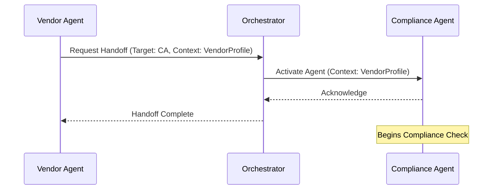

# Agent Communication Patterns

## Overview

This document defines the standard patterns and protocols for communication between agents within the Smart Procurement Co-Pilot system. It establishes rules for message formatting, state management, handoffs, and error propagation to ensure robust multi-agent orchestration.

---

## 1. Communication Architecture

### 1.1 Interaction Modes

The system supports two primary modes of agent interaction:

| Mode | Description | Use Case | Implementation |
|------|-------------|----------|----------------|
| **Synchronous (Direct)** | Agent A calls Agent B and waits for a response. | Real-time queries, sequential validation steps. | Direct function call / REST API |
| **Asynchronous (Event)** | Agent A publishes an event; Agent B reacts later. | Long-running tasks, notifications, decoupling. | Message Queue / Event Bus |

### 1.2 Message Protocol

All inter-agent communication must adhere to the **Standard Agent Message (SAM)** format:

```json
{
  "message_id": "msg-uuid-1234",
  "correlation_id": "corr-uuid-5678",
  "timestamp": "2025-11-23T10:00:00Z",
  "sender": {
    "agent_id": "vendor_onboarding_agent",
    "role": "initiator"
  },
  "recipient": {
    "agent_id": "compliance_agent",
    "role": "validator"
  },
  "message_type": "REQUEST | RESPONSE | EVENT | ERROR",
  "payload": {
    "action": "validate_vendor",
    "data": { ... },
    "context": { ... }
  },
  "metadata": {
    "priority": "high",
    "timeout_ms": 5000
  }
}
```

---

## 2. Handoff Patterns

### 2.1 Sequential Handoff (The "Relay")

Used when one agent completes a task and passes the entire context to the next agent in the workflow.

**Scenario:** Vendor Agent finishes data collection -> Passes to Compliance Agent.

**Protocol:**
1.  **Sender** finalizes its local state.
2.  **Sender** constructs a `REQUEST` message containing the `shared_context`.
3.  **Orchestrator** routes the message to the **Recipient**.
4.  **Recipient** acknowledges receipt.
5.  **Sender** terminates its active turn.

**Diagram:**


### 2.2 Sub-Task Delegation (The "Subcontractor")

Used when an agent needs a specific answer from another agent but intends to resume control afterwards.

**Scenario:** Requisition Agent needs a budget check from Finance Agent (conceptually) or executes a skill.

**Protocol:**
1.  **Parent Agent** pauses execution and pushes state to stack.
2.  **Parent Agent** sends `REQUEST` to **Child Agent**.
3.  **Child Agent** executes task and returns `RESPONSE`.
4.  **Parent Agent** pops state and integrates the result.

---

## 3. Shared State Management

### 3.1 The Context Object

State is maintained in a `Global Context` object that persists across the workflow lifecycle.

```json
{
  "workflow_id": "wf-101",
  "status": "IN_PROGRESS",
  "current_agent": "compliance_agent",
  "entities": {
    "vendor": {
      "id": "v-123",
      "name": "Acme Corp",
      "status": "pending_validation"
    },
    "requisition": null
  },
  "history": [
    { "agent": "vendor_agent", "action": "collected_data", "timestamp": "..." }
  ],
  "artifacts": [
    { "type": "document", "url": "s3://..." }
  ]
}
```

### 3.2 State Mutability Rules

1.  **Owner Write-Only:** Only the currently active agent can modify the `entities` section relevant to its domain.
2.  **Append-Only History:** Agents can only append to the `history` array; they cannot modify past entries.
3.  **Locking:** The Orchestrator locks the context during handoffs to prevent race conditions.

---

## 4. Error Propagation & Recovery

### 4.1 Error Message Format

```json
{
  "message_type": "ERROR",
  "error": {
    "code": "VALIDATION_FAILED",
    "message": "Tax ID format is invalid",
    "source": "compliance_agent",
    "severity": "CRITICAL",
    "retryable": false
  }
}
```

### 4.2 Recovery Strategies

1.  **Local Retry:** Agent attempts to fix the issue itself (e.g., re-prompting the user).
2.  **Escalation:** Agent sends an `ERROR` message to the Orchestrator.
    *   Orchestrator checks `workflow_policy`.
    *   If `retry_limit` not reached, re-instantiate agent.
    *   If fatal, route to **Human-in-the-Loop**.

---

## 5. Human-in-the-Loop (HITL) Protocol

When an agent cannot proceed or confidence is low, control is handed to a human operator.

**Protocol:**
1.  Agent sets status to `WAITING_FOR_HUMAN`.
2.  System sends notification (Email/Slack) to assigned role.
3.  Workflow suspends.
4.  Human reviews context via Dashboard and provides input.
5.  System injects human input as a `RESPONSE` message.
6.  Agent resumes execution.

---

## 6. Security in Communication

*   **Encryption:** All inter-agent messages are encrypted in transit (TLS 1.3).
*   **Identity:** Each agent has a unique Service ID and authenticates via mTLS.
*   **Audit:** Every message payload is hashed and logged to the immutable Audit Trail.

---

**Document Version:** 1.0
**Last Updated:** November 2025
**Status:** Approved
