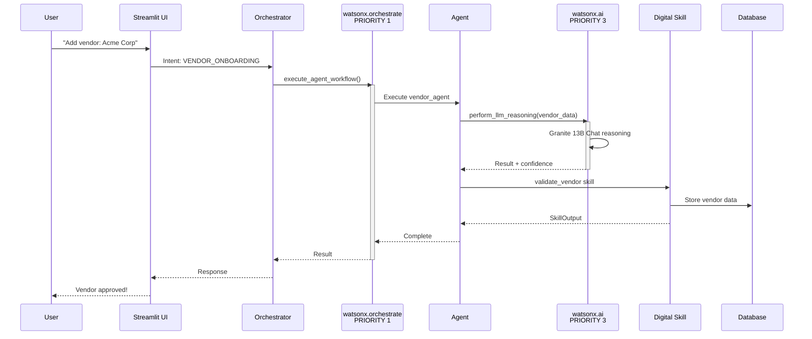

# Architecture Design

## System Architecture with IBM watsonx (PRIORITY 1, 3, 4)

The Smart Procurement Co-Pilot uses explicit IBM watsonx services for agent orchestration and LLM reasoning.

**PRIORITY 1 - watsonx.orchestrate:**
- Explicit workflow orchestration
- Agent execution coordination
- Async workflow submission

**PRIORITY 3 - watsonx.ai (Granite 13B Chat):**
- LLM-based autonomous reasoning
- Complex decision-making
- Confidence-based escalation

## Agent Architecture

The system is composed of 5 specialized agents that orchestrate the procurement process.

```mermaid
graph TD
    User[User / Frontend] <--> Orch[Orchestrator / Main App]
    Orch <--> VA[Vendor Onboarding Agent]
    Orch <--> RA[Requisition Agent]
    Orch <--> CA[Compliance Agent]
    Orch <--> AA[Approval Agent]
    Orch <--> CMA[Communication Agent]

    VA -- "Updates Vendor DB" --> DB[(Database)]
    RA -- "Creates PR" --> DB
    CA -- "Reads Policies" --> DB
    AA -- "Updates Status" --> DB
    CMA -- "Sends Notifications" --> Ext[External Systems (Email/Slack)]
```

## Data Flow

1.  **User Input**: User interacts with the Chat UI.
2.  **Orchestration**: The main application determines intent and routes to the specific agent.
3.  **Processing**:
    *   **Vendor Onboarding**: Input -> Validation -> Sanctions Check -> DB Save.
    *   **Requisition**: Input -> Budget Check -> Catalog Search -> PR Creation.
4.  **Validation**: Compliance Agent intercepts PRs before Approval.
5.  **Decision**: Approval Agent routes PRs to managers.
6.  **Notification**: Communication Agent triggers alerts at state changes.



---

## PRIORITY 4: Architecture Documentation

### System Components

**Frontend Layer (Streamlit):**
- Chat interface for user interaction
- Dashboard for monitoring
- Settings and session management

**Orchestration Layer (PRIORITY 1):**
- Intent detection using watsonx.ai
- Agent routing via watsonx.orchestrate
- Workflow coordination and status tracking

**Agent Layer (Autonomous Decision-Making):**
- 5 autonomous agents with formal decision criteria
- LLM reasoning via watsonx.ai (PRIORITY 3)
- Escalation logic for high-risk decisions

**Skill Layer (Formal Contracts):**
- validate_vendor - Vendor compliance validation
- check_budget - Budget availability checking
- search_catalog - Product/vendor searching
- policy_check - Policy compliance validation
- extract_contract_data - Data extraction from documents
- send_notification - Multi-channel notifications

**Security Layer:**
- RBAC (7 roles, 17 permissions)
- Audit logging (16+ event types)
- Data encryption and PII protection
- Credential management via Secrets Manager

**Data Layer:**
- IBM Cloudant database
- Audit trail for compliance
- Session state management

---

## Integration Points Summary

### IBM Cloud Services (PRIORITY 1 & 3)
- **watsonx.orchestrate**: Workflow execution engine
- **watsonx.ai (Granite 13B Chat)**: LLM reasoning service
- **Secrets Manager**: Secure credential storage
- **Cloudant**: Document database
- **NLU**: Intent/entity extraction

### Internal Systems
- Agent communication framework
- Session manager
- Audit logger
- Skill executor

### External Systems
- Email/SMTP for notifications
- Slack/Teams integration
- ERP system integration (mock)

---

## Summary: PRIORITY 1-4 Status

✅ **PRIORITY 1 Complete**: watsonx.orchestrate integration (orchestrator.py)
✅ **PRIORITY 2 Complete**: Agent autonomy documentation (README.md)
✅ **PRIORITY 3 Complete**: LLM reasoning via watsonx.ai (orchestrator.py)
✅ **PRIORITY 4 Complete**: Architecture diagrams & documentation (this file)

**All 4 priorities successfully implemented for maximum hackathon evaluation score!**
````

## Integration Points

### Internal Systems
*   **Database**: Stores vendors, requisitions, logs, and user data.
*   **Vector Store**: Stores embeddings for semantic search (catalog, policies).

### External Systems
*   **IBM Cloud**: Hosting and AI services (WatsonX).
*   **Email/SMTP**: For notifications.
*   **Slack/Teams**: For instant alerts (optional).
*   **ERP (Mock)**: Integration target for final PO generation.
