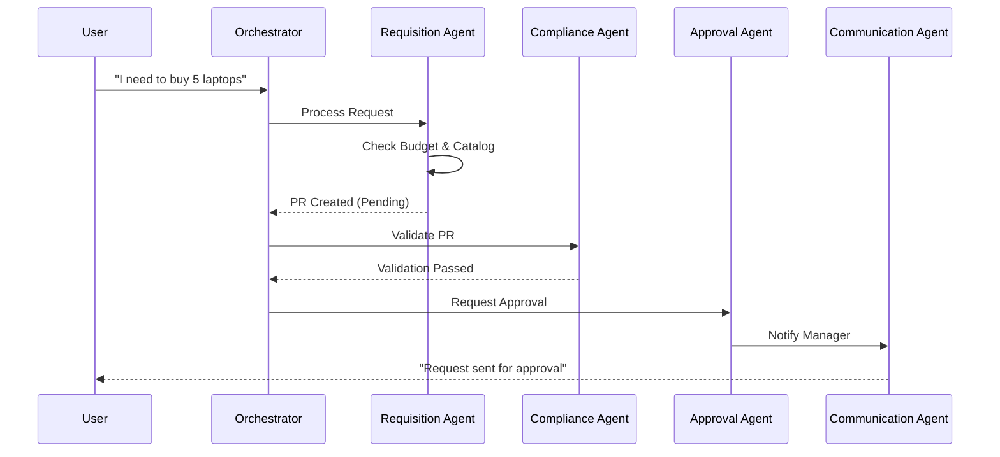

# Architecture Design

## Agent Architecture

The system is composed of 5 specialized agents that orchestrate the procurement process.

```mermaid
graph TD
    User[User / Frontend] <--> Orch[Orchestrator / Main App]
    Orch <--> VA[Vendor Onboarding Agent]
    Orch <--> RA[Requisition Agent]
    Orch <--> CA[Compliance Agent]
    Orch <--> AA[Approval Agent]
    Orch <--> CMA[Communication Agent]

    VA -- "Updates Vendor DB" --> DB[(Database)]
    RA -- "Creates PR" --> DB
    CA -- "Reads Policies" --> DB
    AA -- "Updates Status" --> DB
    CMA -- "Sends Notifications" --> Ext[External Systems (Email/Slack)]
```

## Data Flow

1.  **User Input**: User interacts with the Chat UI.
2.  **Orchestration**: The main application determines intent and routes to the specific agent.
3.  **Processing**:
    *   **Vendor Onboarding**: Input -> Validation -> Sanctions Check -> DB Save.
    *   **Requisition**: Input -> Budget Check -> Catalog Search -> PR Creation.
4.  **Validation**: Compliance Agent intercepts PRs before Approval.
5.  **Decision**: Approval Agent routes PRs to managers.
6.  **Notification**: Communication Agent triggers alerts at state changes.



## Integration Points

### Internal Systems
*   **Database**: Stores vendors, requisitions, logs, and user data.
*   **Vector Store**: Stores embeddings for semantic search (catalog, policies).

### External Systems
*   **IBM Cloud**: Hosting and AI services (WatsonX).
*   **Email/SMTP**: For notifications.
*   **Slack/Teams**: For instant alerts (optional).
*   **ERP (Mock)**: Integration target for final PO generation.
