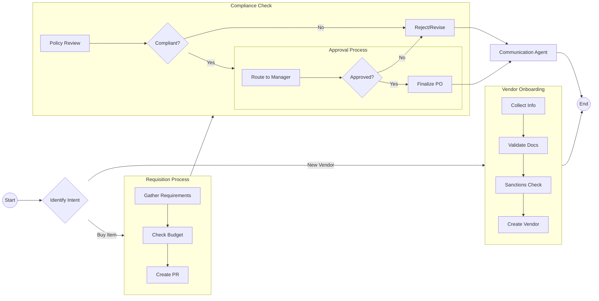

# Procurement Workflows

## Overall Workflow

The procurement process is divided into distinct stages managed by specific agents.

## Agent Interaction Patterns

*   **Handoffs**: Agents return control to the Orchestrator after completing their sub-task. The Orchestrator then invokes the next agent.
*   **Shared State**: All agents read from and write to a shared database/context to maintain continuity.
*   **Asynchronous Notifications**: The Communication Agent operates asynchronously to avoid blocking the main workflow.
